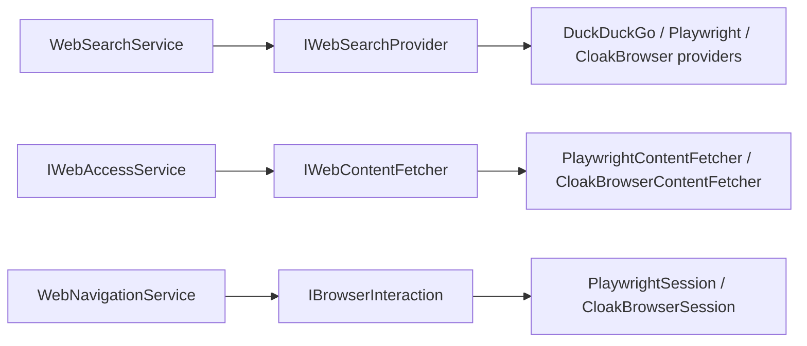

# WebTools.NET Developer Manual

Web tools for .NET applications: web search, browser-based content fetching,
navigation, and caller-controlled browser sessions.

WebTools.NET is a NuGet library that gives applications, workflows, and
orchestration layers reliable access to the web — searching, fetching page
content, checking URL reachability, and navigating with a choice of browser
engines.

## Feature Overview

| Capability | Entry point | Description |
| --- | --- | --- |
| Web search | `WebSearchService`, `IWebSearchProvider` | Search the web via DuckDuckGo (HTTP) or browser-based providers |
| Content fetching | `IWebContentFetcher` | Retrieve rendered page content through headless browsers |
| URL reachability | `IWebAccessService` | Plain-HTTP reachability checks with redirect tracking |
| Navigation | `WebNavigationService` | Same-host link extraction and navigation |
| Browser session | `BrowserSession` | Caller-controlled stateful browser operations and snapshots |
| Geo-awareness | `GeoRegionService` | IP-based region detection with locale fallback |
| Dependency injection | `AddWebToolsCore()`, `AddBrowserServices()` | One-line integration via `IServiceCollection` extensions |

## Architecture at a Glance

All capabilities sit behind small abstractions in the `WebTools.NET.Abstractions`
namespace, so you can depend on interfaces and swap implementations:

Every operation returns a result object (`SearchResult`, `WebContent`,
`UrlCheckResult`) instead of throwing — see
[Error Handling](concepts/error-handling.md).

## Where to Start

- New to the library? Follow [Installation](getting-started/installation.md)
  and the [Quick Start](getting-started/quick-start.md).
- Choosing between browser backends? Read
  [Browser Engines](concepts/browser-engines.md).
- Looking for a specific type? Check the
  [API Reference](api-reference/interfaces.md).

## License

MIT — see the [LICENSE.txt](https://github.com/AlexNek/WebTools.NET/blob/master/LICENSE.txt)
in the repository.
