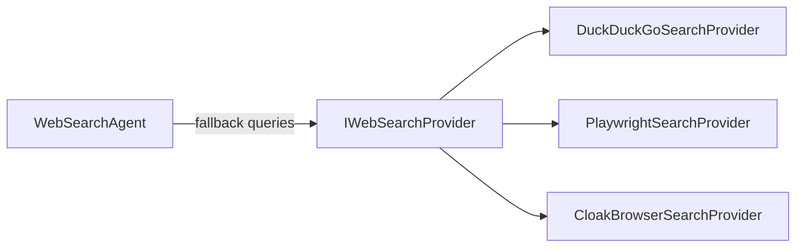

# Web Search Overview

Web search is built around the `IWebSearchProvider` abstraction and the
`WebSearchAgent` orchestrator.



## Choosing an Entry Point

| Entry point | Use it when |
| --- | --- |
| `WebSearchAgent` | You want automatic fallback queries on empty results |
| `IWebSearchProvider` (any implementation) | You want a single raw search call |

## The Search Contract

All providers implement:

```csharp
Task<SearchResult> SearchAsync(
    string query,
    int maxResults = 5,
    CancellationToken ct = default);
```

The returned `SearchResult` carries a `Success` flag, the list of
`SearchResultItem` entries (`Title`, `Url`, `Snippet`), and an `ErrorMessage`
on failure — see [Error Handling](../concepts/error-handling.md).

## Basic Usage

```csharp
using WebTools.NET.Search;

using var ddg = new DuckDuckGoSearchProvider();
await using var agent = new WebSearchAgent(ddg);

var result = await agent.SearchAsync(".NET dependency injection", maxResults: 10);
if (result.Success)
{
    foreach (var item in result.Results)
    {
        Console.WriteLine($"{item.Title} | {item.Snippet}");
        Console.WriteLine($"  {item.Url}");
    }
}
```

## Provider Details

See [Search Providers](providers.md) for the tradeoffs of each provider, and
[WebSearchAgent](web-search-agent.md) for fallback behavior.
